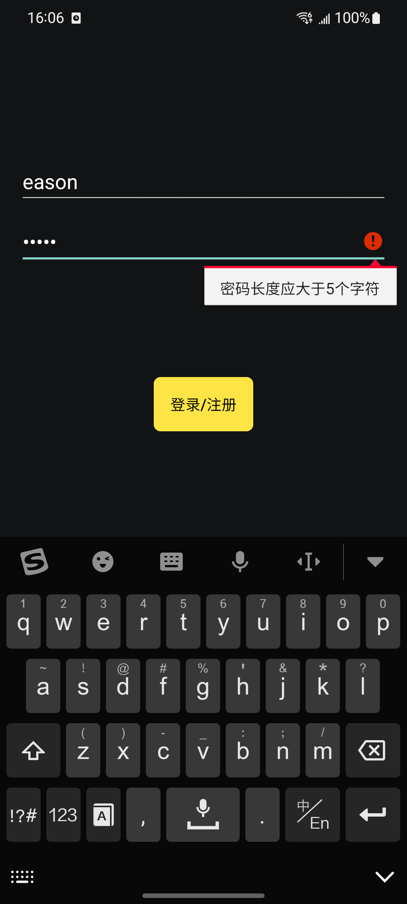
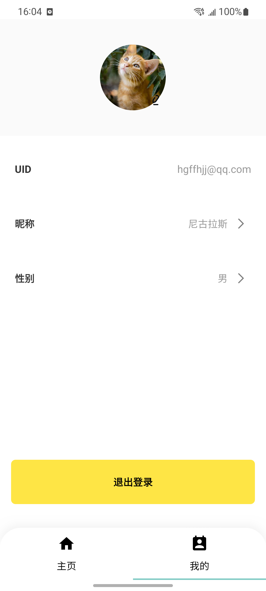
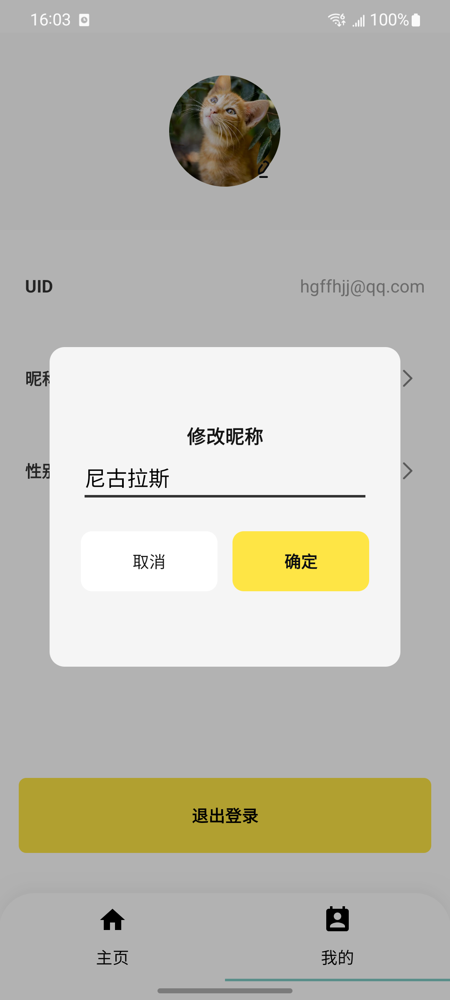
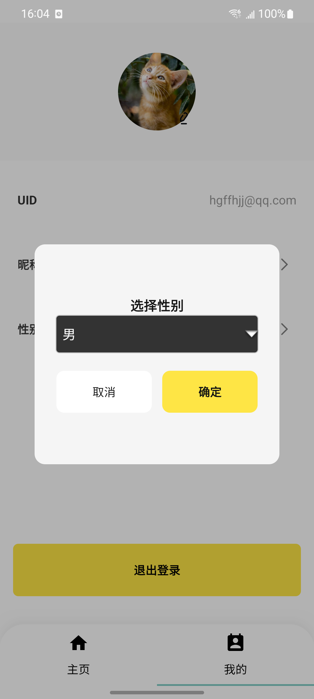

# HomeTask 1.0
使用jetpack架构组件制作的一个包含主页浏览新闻、搜索、用户注册，登录，登出以及查看和修改个人信息的App

[Download Demo Apk](https://github.com/BinQi/HomeTask/blob/master/app/demo/app-debug.apk?raw=true) 

## 效果

| 主页 |
|:-----------:|
||

| 搜索 | 登录 |
|:-----------:|:--------:|
|| |

| 个人页 | 编辑昵称 | 修改性别 |
|:-----------:|:--------:|:---------:|
| |  | |

| 选图1 | 选图2 |
|:-----------:|:--------:|
| | |